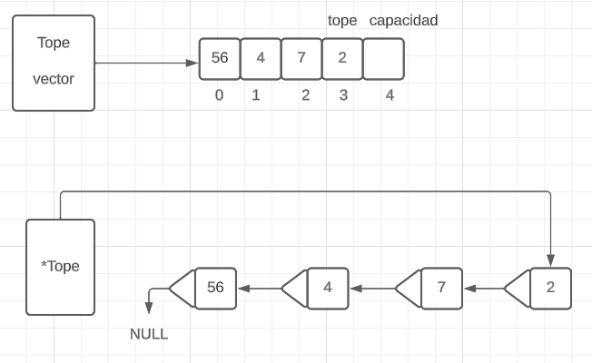
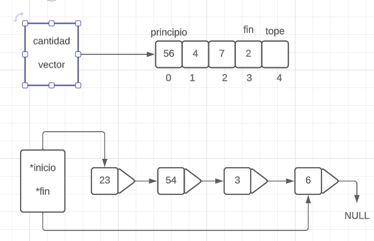
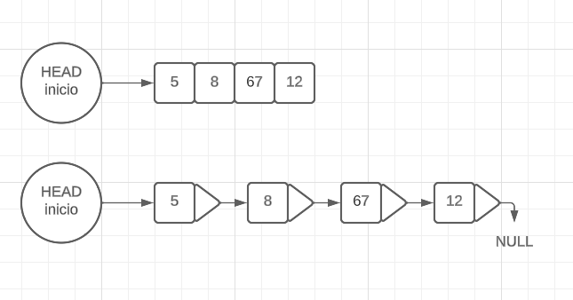

<div align="right">

</div>

# NOMBRE TP/TDA

## Repositorio de Amato Gaspar Jose - 111137 - gasparamato0304@gmail.com

- Para compilar:

```bash
línea de compilación
```

- Para ejecutar:

```bash
línea de ejecución
```

- Para ejecutar con valgrind:
```bash
línea con valgrind
```
---
##  Funcionamiento

Explicación de cómo funcionan las estructuras desarrolladas en el TP y el funcionamiento general del mismo.

Aclarar en esta parte todas las decisiones que se tomaron al realizar el TP, cosas que no se aclaren en el enunciado, fragmentos de código que necesiten explicación extra, etc.

Incluír **EN TODOS LOS TPS** los diagramas relevantes al problema (mayormente diagramas de memoria para explicar las estructuras, pero se pueden utilizar otros diagramas si es necesario).

## Respuestas a las preguntas teóricas
Incluír acá las respuestas a las preguntas del enunciado (si aplica).

1- ¿Qué es una lista/pila/cola?
    Una pila es una coleccion de elementos que cumple con la caracteristica de que solo podemos acceder al ultimo elemento de la misma, por lo tanto solo desapiar el ultimo elemento de la misma, esto quiere decir que cumple con una politica LIFO ("last in first out"). 
<div align="center">
    
</div>
    Como se puede ver en el diagrama, el TDA pila, en el primer caso apunta al vector, y dentro de la estructura se encuentra el tope y el vector. Este vector solo se debe acceder desde la posicion tope. En el segundo caso una pila con nodos simplemente enlazados, en donde el TDA apunta al tope, o sea, el ultimo nodo apilado. Las operaciones que se implementan con esta TDA son:
    •Crear
    •Apilar
    •Tope
    •Destruir 
    •Desapilar
    •Vacia
    
    Una cola tambien es un conjunto de elementos, pero a diferencia de la pila cumple con la politica FIFO ("first in first out"), lo que quiere decir que ahora el primer elemento en ser encolado sera tambien el primer elemento en ser desencolado.
<div align="center">
    
</div>
    Las operaciones de este TDA son:
    •Crear
    •Destruir
    •Encolar
    •Desencolar
    •Pimero
    •Vacio
    
    Por ultimo las listas son un TDA que a diferencia de las dos anteriores, se puede acceder a cualquiera de los elementos y tambien se puede eliminar cualquiera de los elementos de la lista sin importar su posicion.
<div align="center">
    
</div>
    Para acceder a cualquier elemento de la lista, se debe iterar las lista por todos sus elementos o hasta llegar ala elemento deseado, ya que la estruct de la lista contiene solamente el inicio de la lista o el primer nodo en el caso de una lista simplemente enlazada. Las operaciones que se pueden hacer con la lista son:
    •Crear 
    •Insertar
    •Vacia
    •Destruir
    •Eliminar
    •Ver elemento
    
2- Explica y analiza las diferencias de complejidad entre las implementaciones de lista simplemente enlazada, doblemente enlazada y vector dinámico para las operaciones:
   - Insertar/obtener/eliminar al inicio
   - Insertar/obtener/eliminar al final
   - Insertar/obtener/eliminar al medio
   
   LISTAS SIMPLEMENTE ENLAZADAS:
   • La complejidad de insertar al inicio, obtener el inicio y eliminar el primer elemento son todas O(1), esto se debe a que para eliminar o insertar un nodo al principio no se debe iterar toda la lista porque el head ya apunta al inicio de la lista.
   • La Complejidad de Insertar/obtener/eliminar al final es de O(n) ya que ahora para llegar al ultimo elemento debemos iterar por toda la lista.
   •La complejidad de Insertar/obtener/eliminar al medio tambien es O(n) ya que llevado al infinito, por mas que sea solo la mitad de la lista infinito dividido dos es tambien infinito.
   
   LISTAS DOBLEMENTE ENLAZADAS
   • Al igual que las simplemente enlazadas la complejidad de insertar al inicio, obtener el inicio y eliminar el primer elemento son todas O(1), esto se debe a que para eliminar o insertar un nodo al principio no se debe iterar toda la lista porque el head ya apunta al inicio de la lista.
   • En este caso Insertar/obtener/eliminar al final ya no es O(n), es O(1), ya que la estructura principal para la lista doblemente enlazada, tambien contiene la "cola"(ultimo nodo de la lista) y no necesita de iterar toda la lista.
   • En caso de Insertar/obtener/eliminar al medio de la lista, la complejidad de estas operaciones es O(n) ya que se debe iterar la lista hasta llegar al elemento deseado.
   VECTOR DINAMICO 
   •La complejidad de insertar o eliminar el primer elemento es O(n) esto se debe porque en ambos casos debemos de desplazar todo en vector, obtener inicio en cambio es O(1) ya que no hay que iterar nada.
   •Insertar/obtener/eliminar al final de la lista, la complejidad O(1) ya que la estructura no se itera, sino que directamente llamo al ultimo nodo.
   • En caso de Insertar/obtener/eliminar al medio de la lista, para obtener el valor del elemento la complejidad es O(1), ya que para acceder a el, solo necesitamos la posicion. En cambio para insertar o eliminar un valor de en medio debemos desplazar para adelante o para atras para que siga siendo un lista, por lo que debemos iterar la lista y entonces nos daria una complejidad de O(n). 
   
   3- Explica la complejidad de las operaciones implementadas en tu trabajo para la pila y la cola.
   
   COLA:
   
```c
  cola_t *cola_crear()
  
```
  •Cola_crear tiene una complejidad de O(1), ya que crea la cola reservando con un malloc, el espacio de memoria en el heap necesario para alamacenar una estructura cola, luego asigna los punteros principio y final del TDA cola a NULL y devuelve una cola vacia, no itera nada.
     
```c
  cola_t *cola_encolar() 
```
 •La operacion encolar tambien es O(1) ya que, reserva espacio en el heap con el malloc para una estructura nodo, luego le ingresa un elemento al puntero elemento de nodo. Revisa si la cola esta vacia, ya que si efectivamente esta vacia, asigna a los punteros principio y final al nodo creado, luego le dice que el puntero siguiente del anterior al nuevo nodo(o sea el ultimo elemento de la cola), ahora apunte al nuevo nodo y que el puntero final de la estructura cola ahora tambien apunte al nuevo nodo. Todas este codigo requiere un tiempo de ejecucion constante, por eso O(1).
 
```c
  void *cola_desencolar() 
```
 •La funcion cola_desencolar(), no requiere ninguna iteracion, ya que la estructura cola apunta directamente al primer elemento de la cola por lo que no necesito iterarla. Lo que hago es crear un puntero nodo auxiliar que apunta al principio de la cola, luego el puntero principio de la estructura cola, lo apunto a el siguiente nodo del principio, gracias al puntero nodo auxiliar no pierdo la referencia del nodo a desencolar y con un free, libero la memoria reservada. Todo esto es O(1) ya que ninguna ietracion es requerida.
 
```c
  void *cola_frente() 
```
 •Esta funcion muestra el elemento del principio de la cola lista, esto no requiere ninguna iteracion ya que la estructura de la cola tiene un puntero que apunta al principio de la misma, por eso esta funcion es O(1). 
 
```c
  size_t *cola_tamanio() 
```
 •En mi implementacion esta funcion es O(1) porque la estructura cola, tiene una variable tamanio que tiene la cantidad de nodos de la cola. Por lo que solo llamo a esa variable dentro de la estructurea cola. 
 
```c
  bool cola_vacia() 
```
 •Cola vacia es una funcion que utiliza tambien la variable de tamanio, por lo que no itera nada. lo que hace es que si la comparacion tamanio == 0 es verdadera devuelve true y sino devuelve false. por esto es O(1).

```c
  void cola_destruir() 
```
 •Cola destruir es una funcion que recorre toda la cola liberando nodo por nodo. Esto lo hace utilizando la funcion cola_vacia, que devuleve true si la funcion esta vacia, por eso le puse un "!" para que reprodujera lo contrario al resultado en un while(), entonces si la cola estaba vacia lo contario al true es false y el while() se corta. Luego fui utilizando la funcion desencolar, para que vaya desencolando elemento por elemento y por ultimo libera la estructura cola. Debido a esta iteracion simple la funcion es O(n). 
 
    PILA:
    
```c
  pila_t *pila_crear() 
```
 •La funcion crear, reserva un espacio en el heap igual al tamaño de un estructura pila y los punteros de tope y tamanio apuntan a NULL y 0 respectivamente, y devuelve una pila vacia. Al no iterar nada es O(1).
 
```c
  pila_t *pila_apilar() 
```
 •La funcion apilar reserva el espacio del tamaño de un nodo y analiza el caso de si el tamaño de la pila es 0, pero si no lo es, lo que hace es hacer que el puntero anterior del nuevo nodo apunte al nodo tope(o sea el ultimo nodo) y luego cambia el puntero tope de la estructura pila al nuevo nodo. Todo esto tiene un tiempo de ejecucion constante porque no se itera nada por lo que es O(1).

```c
  void *pila_desapilar() 
```

 •Esta funcion genera un puntero auxiliar que apunta al ultimo nodo del la pila, luego hace que el puntero tope de la pila apunte al anterior del ultimo nodo, gracias al auxiliar no pierdo la referencia del nodo a desapilar y pueo liberarlo, es O(1).
 
```c
  void *pila_tope() 
  size_t pila_tamanio()
```
 • Ambas funciones son O(1) ya que, la primera llama al puntero elemento dentro del ultimo nodo de la pila y la segunda llama a la variable tamanio dentro de la pila.
 
```c
  bool pila_vacia() 
```
 •Pila vacia es una funcion que utiliza tambien la variable de tamanio, por lo que no itera nada. Lo que hace es que si la comparacion tamanio == 0 es verdadera devuelve true y sino devuelve false. por esto es O(1).

```c
  void pila_destruir() 
```
•Esta funcion es casi igual que la funcion cola_destruir(), en lo unico que se diferencia es que en vez de las funciones "cola vacia()" y "cola desencolar()", utiliza la funcion "pila vacia()" que funciona igual que la de "cola vacia()", y "pila desapilar()" que se diferencia de la de cola en que al desapilar se realiza desde el ultimo elemento ya que resepta la politica LIFO("last in fist out"). Esta funcion es O(n) ya que al igual que la funcion de cola itera toda la cola.
